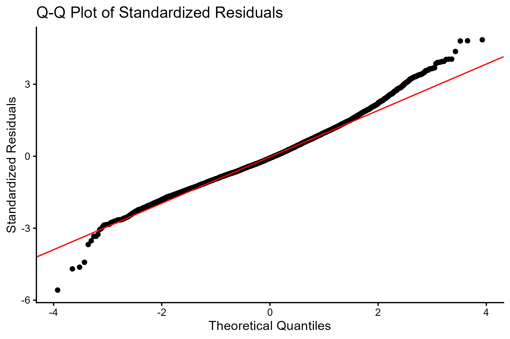
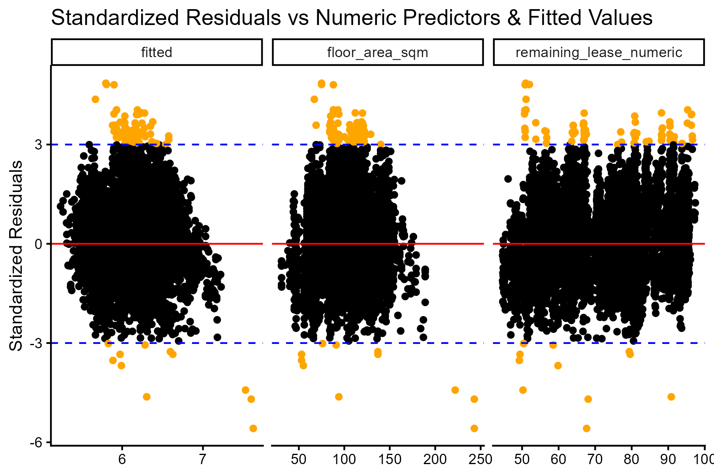

# HDB Resale Price Regression Model 
This project develops and validates a robust linear regression model to predict HDB resale prices using 2021 government data. The analysis focuses on feature selection, transformation, model diagnostics, and validation, with the goal of identifying key price drivers while ensuring model adequacy. Below is a summary of the key insights and steps, full report and R markdown can be found in the repository. 

# Project Overview

This project analyzes 11,527 HDB resale transactions (2021) to understand the key drivers of resale prices. Using exploratory data analysis, feature selection, and log-linear regression, the model evaluates the impact of flat characteristics, location, and remaining lease while rigorously checking for violations of statistical assumptions to ensure model adequacy and reliable results. 

The final model has a strong predictive performance (R² ≈ 0.83) and satisfies all linear regression assumptions, making it both interpretable and statistically reliable.

# Key Insights (ranked by influence)
- **Flat model:** The most influential categorical predictor of resale price.
- **Town region (distance from central area):** Flats closer to central regions (CCR > RCR > OCR) command higher prices. Interestingly, this is a stronger predictor than flat type, meaning smaller flats in prime locations can cost more than larger flats in outlying areas.
- **Flat type (number of rooms)**: Flats with more rooms generally have higher resale prices.
- **Storey range**: Higher-floor flats tend to sell for more.
- **Remaining lease**: Longer remaining lease moderately increases resale price; the limited impact is partly due to most flats having >40 years remaining.
- **Flat size (floor area)**: Larger flats increase resale prices, though its effect is less pronounced than initially expected.

Overall, flat model, type, location, and floor are the primary determinants of resale price. 

# Exploratory Data Analysis

## Distribution of Resale Prices
Log transformation was applied to address right-skewness and extreme values, resulting in a more symmetric distribution and improved model suitability.

## Numeric Predictors Scatter Analysis
- Floor area shows a strong positive association with resale price (r ≈ 0.68)
- Remaining lease shows a moderate effect (r ≈ 0.41)
- No concerning multicollinearity between numeric predictors
images/numeric_predictor_scatter.png

## Categorical Predictors
ANOVA (η²) revealed:
- Flat type and flat model as the most influential categorical drivers. Storey range and town region show meaningful effects.
- Month of sale has negligible explanatory power and was excluded
- Ordinal encoding was applied where logical trends were observed (flat type, storey range, town region) to ensure a more interpretable model.

## Model Diagnostics & Validation

An initial Multiple Linear Regression model was fitted to the 6 identified predictors. The model was evaluated using:
- Residual QQ plots (checking normality)

- Residuals vs fitted values (constant variance)

- Outlier analysis (standardised residuals) + Leverage and Cook’s distance
- GVIF for multicollinearity

Key findings:
Outliers had minimal influence on estimates. No high-leverage or influential observations. Low multicollinearity across predictors.

## Final Model Performance

Multiple Linear Regression model is a satisfactory model for the prediction of HDB resale prices, strong performance of R² ≈ 0.83.

Coefficients were interpretable with strong domain alignment. 

  
